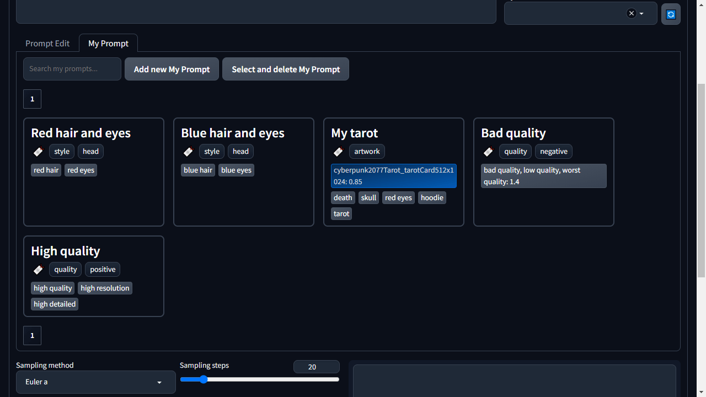
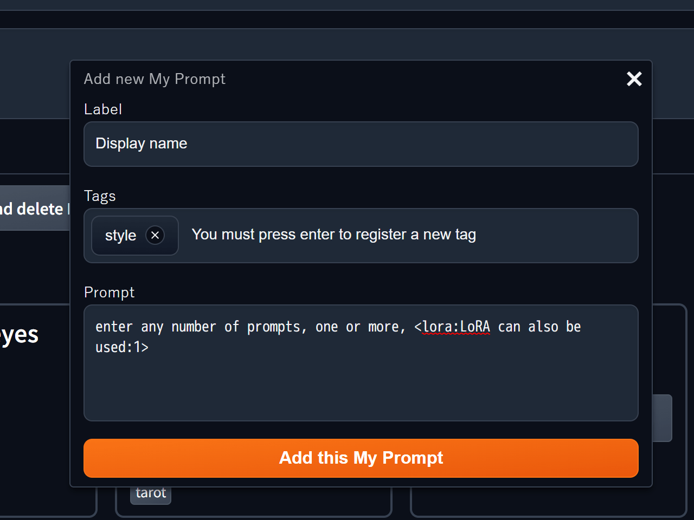
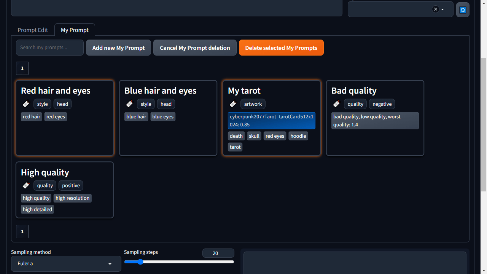

= Better Prompt

English | link:docs/README-ja.adoc[日本語]

Better Prompt is an extension of the https://github.com/AUTOMATIC1111/stable-diffusion-webui[Stable Diffusion web UI] that adds a UI to assist with prompt input and editing.

image::docs/images/overview.png[Image - Overview]

== Overview
Better Prompt was created to reduce the various inconveniences of traditional prompt input and editing. It allows you to set Textual Inversion and LoRA without displaying Extra networks (🎴), rearrange the order of prompts by drag and drop, and adjust the emphasis level of prompts through a GUI.

== Installation
=== Installing from the Browser (Recommended)
You can install it from the "Install from URL" option in the Extensions tab. Simply enter https://github.com/eideehi/sd-webui-better-prompt.git in the "URL for extension's git repository" field and press the "Install" button.

image::docs/images/install.png[Image - Install]

=== Installing using Git
You can also install it by executing the following command in the directory where Stable Diffusion web UI is installed.
[source,shell]
----
git clone https://github.com/eideehi/sd-webui-better-prompt.git extensions/sd-webui-better-prompt
----

=== Better Prompt is not displayed or the display is broken
By installing it using the above methods, the latest version will be installed. However, it may not work well with the version of Web UI you are using. If Better Prompt is not displayed properly, it may be possible to resolve the issue by using a different version.

TIP: You can change the version of Better Prompt from the Settings tab. For more information, refer to <<version-change>>.

== Usage
Better Prompt adds the part enclosed by the red line in the image below. We will explain how to use this added content from now on.

image::docs/images/components.png[Image - Components]

=== Prompt Edit Tab
This is the default content displayed where you can edit the prompt.

==== Prompt Addition Form [[input-form]]
Adding a prompt is done using the three elements shown in the following image.

image::docs/images/input-component.png[Image - Input Component]

===== [1] Prompt Input Field [[input-field]]
Enter a prompt in this field and press the Enter key to add the content to the positive prompt. Alternatively, press the Shift key while pressing Enter to add the content to the negative prompt. If there are *Textual Inversion*, *LoRA*, *Danbooru tags*, or *My Prompt* similar to the input content, they will be displayed in a list in <<suggest-area>>.

TIP: Fuse.js is used for similarity determination, allowing various determination methods such as "exact match," "prefix/suffix," and "AND/OR/NOT" to be used. For more information, refer to the https://fusejs.io/examples.html#extended-search[fusejs.io documentation].

TIP: Press the Tab key to move the focus to the elements in <<suggest-area>>, and press the Escape key to return the focus. The selected element can be added to the positive (negative) prompt by pressing Enter (or Shift + Enter).

===== [2] Suggest Filters
Only elements with a check in these filters will be displayed in <<suggest-area>>.

===== [3] Suggest Area [[suggest-area]]
Displays a list of up to 20 elements similar to the content entered in <<input-field>>. An example of the items to be added is shown in the following image.

image::docs/images/suggest-items.png[Image - Suggest Items]

Green is Textual Inversion, blue is LoRA, and the last is Danbooru tags. Clicking (or Shift-clicking) these elements allows them to be added to the positive (negative) prompt.

NOTE: LoRA cannot be added to the negative prompt, so please be careful.

TIP: You can check the thumbnail by right-clicking on the elements of Textual Inversion and LoRA.

==== Prompt Editing
Prompt editing is done using the two elements shown in the following image.

image::docs/images/prompt-component.png[Image - Prompt Component]

===== [1] Positive Prompt [[positive-prompt]]
Prompts added using <<input-form>> are displayed in this area. This element is synchronized with the positive prompt input area of the web UI.

TIP: Each prompt can be reordered by drag and drop, and can be deleted by clicking while holding the Shift key.

TIP: Right-clicking on LoRA and normal prompts displays a popup for adjusting the emphasis level.

===== [2] Negative Prompt
Except for not being able to add LoRA, it is the same as <<positive-prompt>>.

=== My Prompt Tab
You can assign aliases and tags to any prompt for easy management. The registered My Prompts will be displayed in the <<suggest-area>> when editing prompts.

==== Registering My Prompt
When you click the ``Add new My Prompt`` button, a popup will appear for registering a new My Prompt.

===== Label [[my-prompt-label]]
Set the display name for the My Prompt. This will be used when displayed in suggestions, among other places. *This field is required and cannot be omitted*. Additionally, you cannot set a label that already exists.

===== Tags [[my-prompt-tags]]
By setting tags, you can filter My Prompts based on their tags. When the input field is active, existing tags will be suggested and displayed as a list. You can add a new tag by pressing the Enter key after entering the desired string. This field is optional, and you can omit the input.

===== Prompt [[my-prompt-prompt]]
Set any prompt for the My Prompt. When you click on a My Prompt displayed in the <<suggest-area>>, the prompt you set here will be expanded. This field is required and cannot be omitted.

==== Deleting My Prompt
By clicking on a My Prompt in the displayed list, you can select it by clicking the ``Select and delete My Prompt`` button. Then, you can delete all the selected My Prompts by pressing the ``Delete selected My Prompts`` button. Please note that once you delete a My Prompt, it cannot be restored, so use this feature with caution.

==== My Prompt Search
The search for My Prompts references the elements <<my-prompt-label>>, <<my-prompt-tags>>, and <<my-prompt-prompt>>. If you enter ``style`` in the search form, any My Prompts that contain the string ``style`` in any of the aforementioned elements will be displayed in the search results.

== Configuration
Better Prompt creates its own configuration section in the Settings tab. Here, we will explain each item.

image::docs/images/settings.png[Image - Settings]

=== Version of Better Prompt [[version-change]]
You can change the version of Better Prompt. Selecting a blank space will change it to the latest version at that point. If you change the settings, it is necessary to restart the Web UI. (not just reload)

TIP: The current version of Better Prompt is displayed in the console of the Web UI. Refer to the table below for the Web UI versions corresponding to each version.

|===
| Version       | Web UI Version (Minimum) | Web UI Version (Maximum)
| 0.1.0 - 0.3.0 | 9e1afa9e (2023-03-25)    | 1.3.2
| 0.4.0         | 9e1afa9e (2023-03-25)    | ~
|===

=== Display update notifications
If checked, it will display notifications when updates are available.

=== Notify of updates only once per version
If checked, it will only notify once for each version when updates are available.

=== Interval at which to display update notifications
Specify the interval for displaying update notifications. The unit is "days", and the default value is 1 day.

=== Language of Better Prompt
Specify the language used by Better Prompt. The default value is blank (English). Currently, ja_JP language is available. If you change the settings, it is necessary to reload the Web UI.

== License
Better Prompt is developed and published under the MIT license. For details on the license, please refer to the link below.

link:./LICENSE[MIT License]
