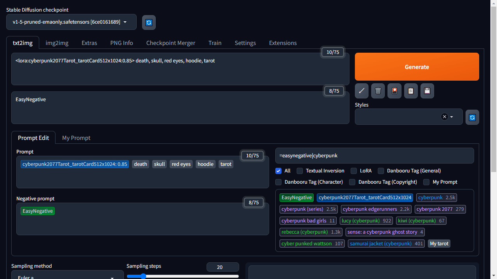
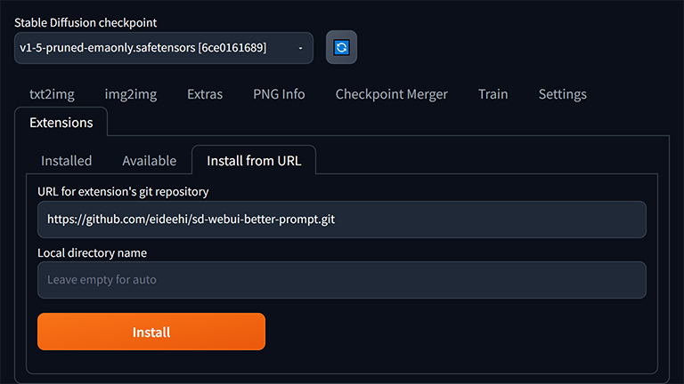
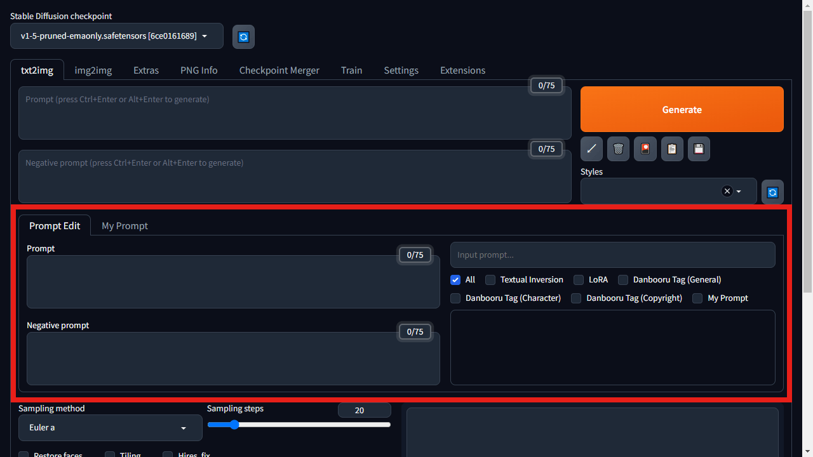
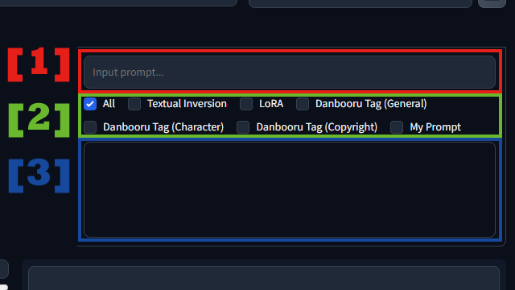
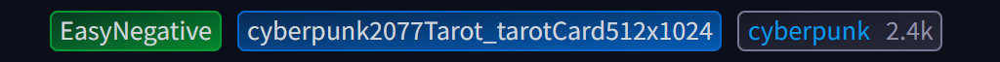
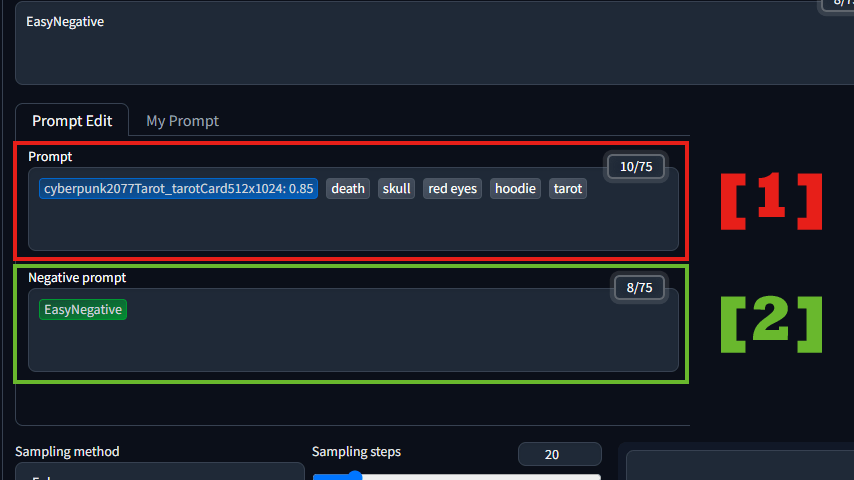
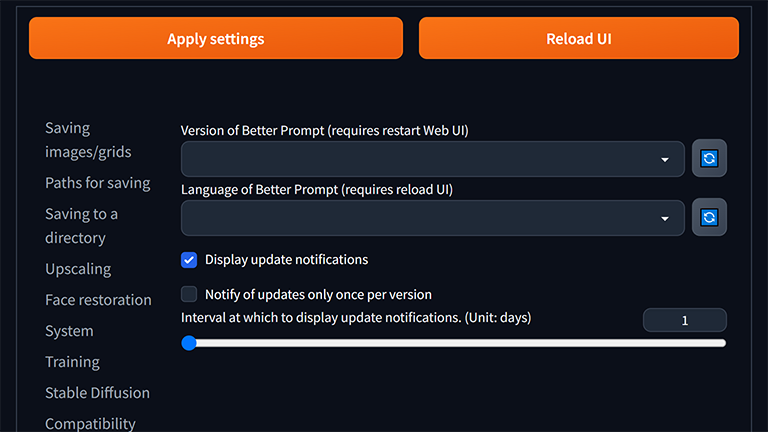

= Better Prompt

link:../README.adoc[English] | 日本語

Better Promptはプロンプト入力・編集を補助するUIを追加する https://github.com/AUTOMATIC1111/stable-diffusion-webui[Stable Diffusion web UI] の拡張機能です。

== 概要
Better Promptは従来のプロンプト入力・編集作業におけるさまざまな煩わしさを軽減するために作られました。Extra networks（🎴）を表示せずにTextual InversionやLoRAを設定したり、プロンプトの順番をドラッグ操作で入れ替えたり、プロンプトの強調レベルをGUIで調整したりすることが可能になります。

== インストール
=== ブラウザからインストール (推奨)
Extensions タブの Install from URL からインストールすることができます。"URL for extension's git repository" の項目に https://github.com/eideehi/sd-webui-better-prompt.git を入力して「Install」ボタンを押すだけです。

=== Gitを使用してインストール
Stable Diffusion web UIをインストールしたディレクトリで以下のコマンドを実行してもインストールすることが可能です。
[source,shell]
----
git clone https://github.com/eideehi/sd-webui-better-prompt.git extensions/sd-webui-better-prompt
----

=== Better Promptが表示されない・表示が崩れている
上記の方法でインストールを行うと、最新のバージョンがインストールされます。しかし、それではあなたの使用しているWeb UIのバージョンではうまく動作しないかもしれません。Better Promptが正常に表示されない場合、別のバージョンを使用することで解決できるかもしれません。

TIP: Better Promptのバージョンは Settings タブから変更することが出来ます。詳しくは <<version_change>> を参照してください。

== 使用方法
Better Promptにより、以下の画像の赤い線で囲われた部分が追加されます。以降ではこの追加された内容について、使い方を説明していきます。

=== プロンプト追加フォーム [[input-form]]
プロンプトの追加は次の画像で示される3つの要素を使用して行います。

==== [1] プロンプト入力フィールド [[input-field]]
このフィールドにプロンプトを入力して、エンターキーを押すことでポジティブプロンプトへ入力した内容が追加されます。またシフトキーを押しながらエンターキーを押すことでネガティブプロンプトに内容が追加されます。また、入力した内容に類似するTextual Inversion・LoRA・Danbooruタグが存在する場合、<<suggest>> に一覧で表示されます。

TIP: 類似判定にはFuse.jsを使用しているため、「完全一致」、「接頭辞・接尾辞」、「AND・OR・NOT」などのさまざまな判定方法を利用することが可能です。詳細は https://fusejs.io/examples.html#extended-search[fusejs.io のドキュメント] を参照してください。

TIP: タブキーを押すと <<suggest>> の要素にフォーカスが移り、エスケープキーを押すとフォーカスが戻ります。選択された要素はエンターキー（あるいはシフトキーを押しながらエンターキー）を押すとポジティブ（ネガティブ）プロンプトへ追加することが出来ます。

==== [2] サジェストフィルター
これらのフィルターにチェックが入っている要素のみ、<<suggest>> に表示されます。

==== [3] サジェストエリア [[suggest]]
<<input-field>> に入力された内容に類似する要素を最大20件まで一覧で表示します。追加されるアイテムの例を画像で示します。

緑はTextual Inversion、青はLoRA、最後はDanbooruタグです。これらの要素をクリック（あるいはシフトキーを押しながらクリック）することで、ポジティブ（ネガティブ）プロンプトへ追加することが出来ます。

NOTE: LoRAはネガティブプロンプトには追加できないので注意してください。

TIP: Textual InversionとLoRAの要素は右クリックすることでサムネイルを確認することができます。

=== プロンプト編集
プロンプトの編集は次の画像で示される2つの要素を使用して行います。

==== [1] ポジティブプロンプト [[positive-prompt]]
<<input-form>> により追加されたプロンプトはこのエリアに表示されます。この要素はWeb UIのポジティブプロンプト入力エリアと相互に同期しています。

TIP: 各プロンプトはドラッグ操作で入れ替えることが可能なほか、シフトキーを押しながらクリックすることで削除することが出来ます。

TIP: LoRAと通常のプロンプトは右クリックすることで強調レベルを調整するためのポップアップが表示されます。

TIP: プロンプトに対する操作は[Ctrl + Z]、[Ctrl + Y]で取り消したり、元に戻したりすることが可能です。

==== [2] ネガティブプロンプト
LoRAを追加することが出来ない以外は <<positive-prompt>> と同じです。

== コンフィグ
Better Promptは、Settings タブに独自のコンフィグセクションを作成します。ここでは、それぞれの項目について説明します。

=== Version of Better Prompt [[version_change]]
Better Promptのバージョンを変更することが出来ます。空白を選択するとその時点での最新バージョンに変更されます。設定を変更した場合、Web UIの再起動が必要です。(リロードではありません)

TIP: Better Promptの現在のバージョンはWeb UIのコンソールに表示されます。各バージョンが対応するWeb UIのバージョンは以下の表を参照してください。

|===
| バージョン    | Web UIのバージョン (最小) | Web UIのバージョン (最大)
| 0.1.0 - 0.3.0 | 9e1afa9e (2023-03-25)     | ~
|===

=== Display update notifications
チェックが入っていると、利用可能なアップデートが存在する場合に通知を表示します。

=== Notify of updates only once per version
チェックが入っていると、各バージョンごとに一度しかアップデートの通知を行いません。

=== Interval at which to display update notifications
アップデートの通知を行う間隔を指定します。単位は 日 で、デフォルト値は1日です。

=== Language of Better Prompt
Better Promptの使用言語を指定します。デフォルト値は空白（英語）です。現在、ja_JP の言語が利用可能です。設定を変更した場合、Web UIのリロードが必要です。

== ライセンス
Better PromptはMITライセンスの下で開発・公開されています。ライセンスの詳細については、以下のリンクからライセンス条文を参照してください。

link:../LICENSE[MITライセンス]
